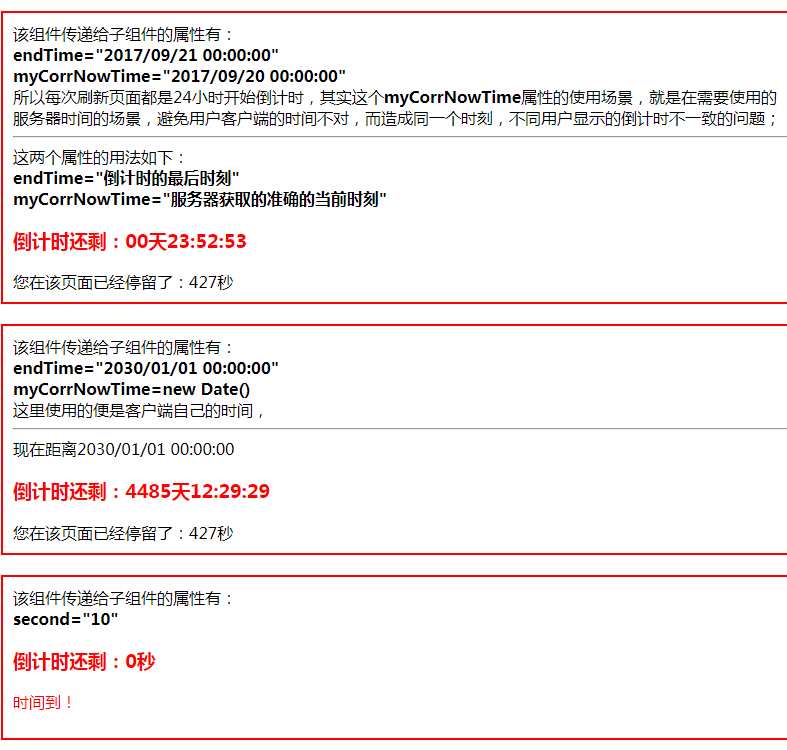

# Countdown Component

## 先上效果图

## 项目启动方法
1. 运行：npm install    安装热更新等依赖
2. 运行：webpack-dev-server   开启热更新
3. 浏览器打开 http://localhost:8080/webpack-dev-server/  即可

## React的倒计时组件，基本用法：
仅仅需要在你的代码中插入如下示例代码即可
**<CountdownComponent  endTime={"2020/01/01 18:30:00"} />**

## Usage👇
**sdfsadf**
**sdfasdfsdfasdf**
**<CountdownComponent endTime={"2017/09/19 18:30:00"} myCorrNowTime={"2017/09/19 18:29:50"} timeoutFn={timeoutFn} />**
**<CountdownComponent endTime={"2030/09/19 18:30:00"} />**